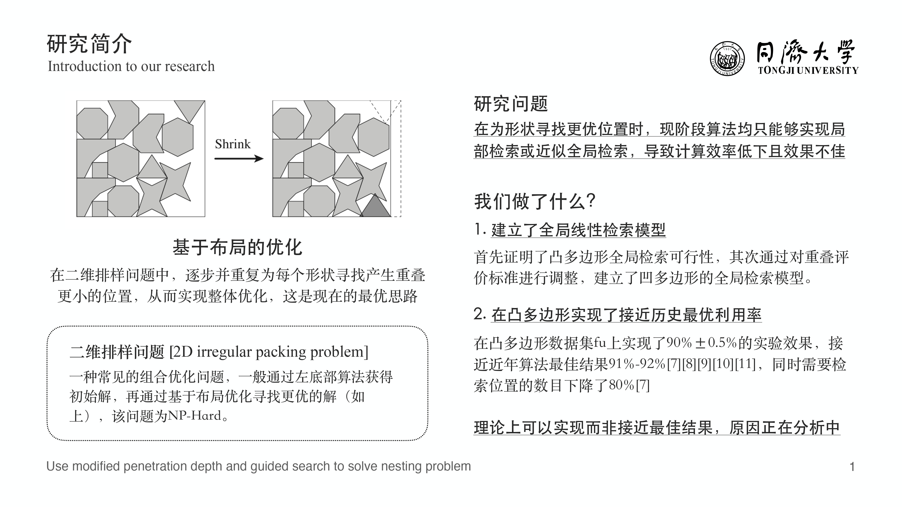
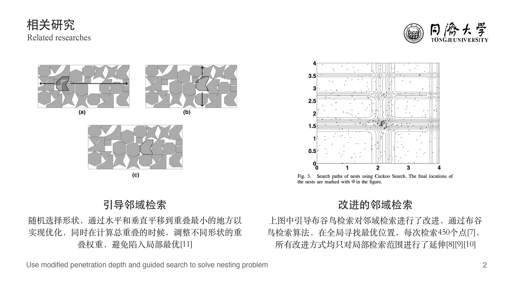
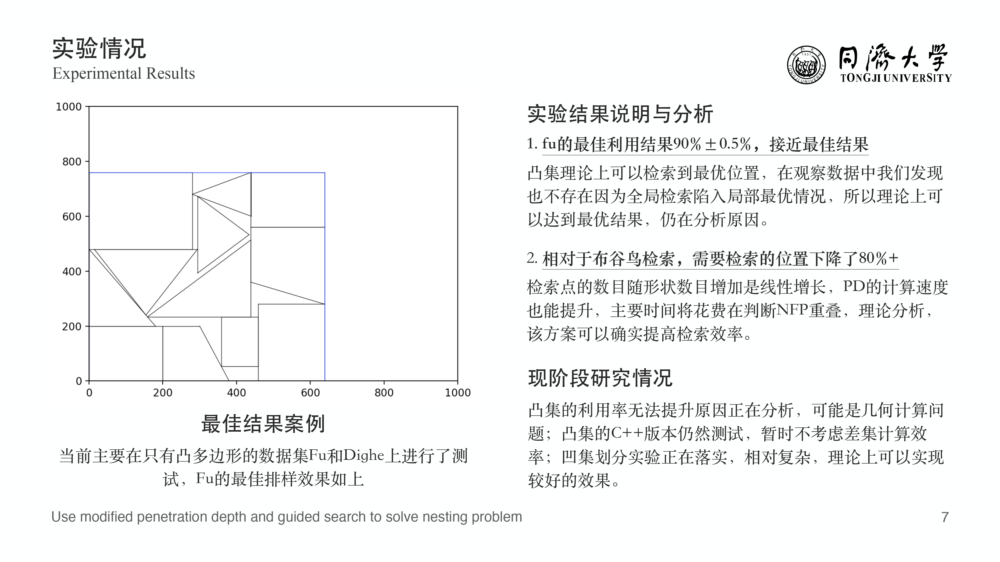
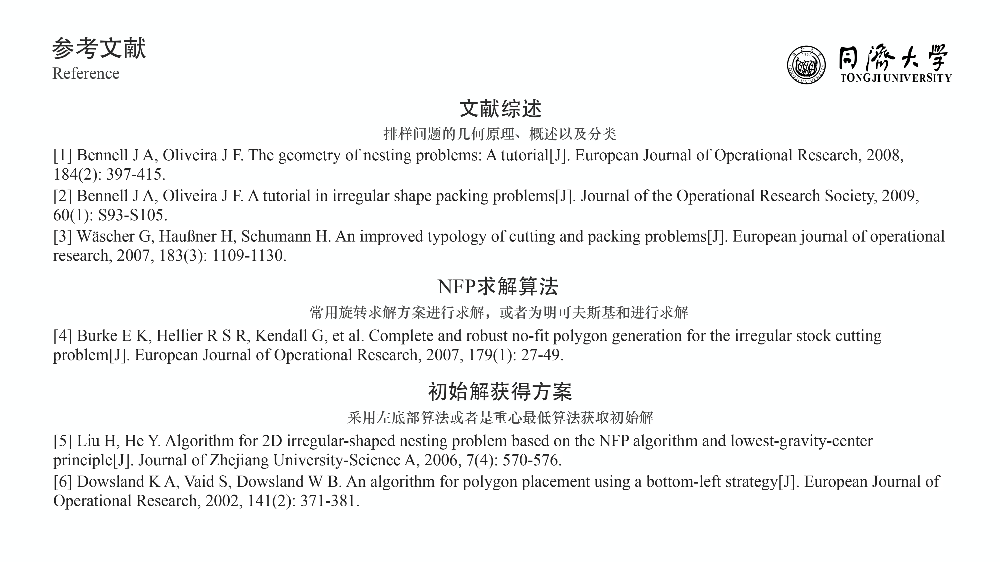
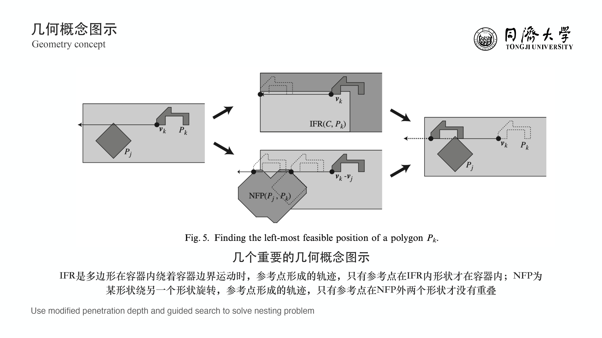
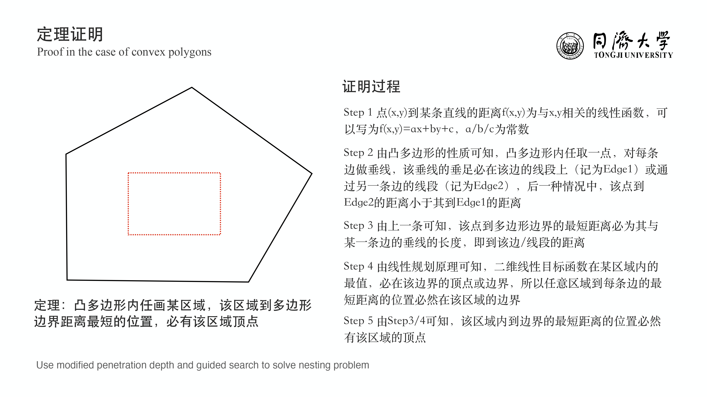

Author: Yang Shan, Wang Zilu 

From: Department of Management Science and Engineering, Tongji University

**We modify penetration depth to make searching new positions for polygons in the global scale feasible with computing complexity reduced.** English version report will ve updated soon.

## Report(Chinese)

## Introduction

2D Nesting problem is a kind of combination optimization problem which tragets at maximizing the utilization ratio by arranging the layout of all shapes. 

It is a NP-Hard problem and to achieve global optimization is almost impossible. As a result, the most common way to optimize the layout is searching a new better position for polygons step by step.

Guided cuckoo search proposed by Elkeran is the methodology that can obtain the best result by now. This approache applied a elvolution algorithm named cuckoo search to settle searching a new position on a two-dimensional plane. 

However, the searching efficiency is low because the best position can't 

**For the cuckoo search, it needs to search over 450 positions and the best position may not be found. However, take dateset fu for example, after about only 50-70 positions be tested, the location with the least penetration depth can be found.**

## What we have done？ 

## Algorithm Outline

## Geometry

### Convex

### Non-Convex

## Experiments

